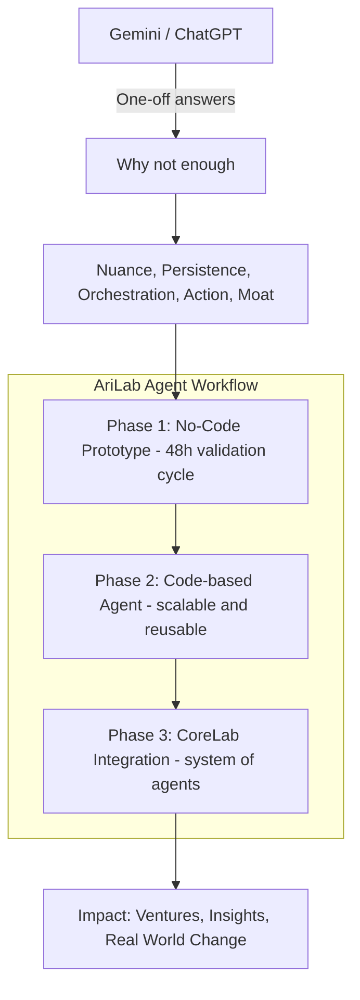

# 🌌 AriLab

> **Problem → Innovation → Impact.**  
AriLab is an **innovation lab and umbrella brand** — like Google X for the next wave of intelligence.  
We exist to **find problems, build agents, and leave impact in the world.**  

Our projects evolve in phases:  
- **Synthetix** → agency arm that drives cashflow.  
- **AriLab Core** → builds reusable agents + infrastructure.  
- **Xplode, UniVerse, and more** → future ventures incubated under the AriLab umbrella.  

📩 **Contact Us**  
- 🌍 Website: *[coming soon]*  
- ✉️ Email: contact@arilab.org  
- 🐦 Twitter/X: [@AriLabAI](https://twitter.com/)  
- 💼 LinkedIn: [AriLab](https://linkedin.com/)  

---

## 🧩 AriLab Agents – Team Guide

AriLab is not about building one product, it’s about building a **system of agents** that continuously discover, validate, and monetize opportunities.  

To avoid confusion, here’s how we’ll work with agents phase by phase.

---

### 🔄 Phase 1: No-Code Prototyping (48h validation cycles)

**Goal:** Fastest way to test if an agent idea works.  

**Tools:**  
- n8n (automation workflows)  
- Zapier / Make (if needed)  
- Dify.ai / Langflow (for quick AI agent logic)  

**Process:**  
1. Each agent starts as a no-code workflow.  
2. Validate in 48h cycles (does it work, add value, give usable output?).  
3. Document results in `docs/opportunity.md` + `docs/validation.md`.  

**Examples:**  
- Market Research Agent = n8n workflow that scrapes Reddit + saves results to Google Sheets.  
- Monetization Agent = Zapier workflow that calculates basic revenue estimates from sample data.  

👉 If it fails, we **iterate or kill fast**. If it works, we move to **Phase 2**.  

---

### ⚙️ Phase 2: Code-based Agents (scalable, reusable)

**Goal:** Turn validated no-code agents into proper coded microservices.  

**Stack:**  
- Python (FastAPI / LangChain / custom scripts)  
- Node.js (for certain integrations)  
- Containerized with Docker  

**Process:**  
1. Start from `arilab-platform` templates (agent scaffold).  
2. Move logic from no-code tool → codebase.  
3. Add unit tests + CI/CD pipelines.  
4. Deploy lightweight versions (Cloud Run / Railway).  

**Repo Workflow:**  
- Each agent has its own repo under the org.  
- Devs work in branches → raise Pull Requests.  
- PRs must include updates to `/docs/validation.md` with test results.  

---

### 🚀 Phase 3: Integration into CoreLab

**Goal:** Connect agents into a system.  

**Infra:**  
- Event bus (Redis / PubSub)  
- Shared schemas (e.g., OpportunityFound, ValidationResult)  
- Observability (Grafana dashboards)  

**Process:**  
1. Agents publish/consume events, not just act alone.  
2. CoreLab dashboard shows outputs & impact of each agent.  
3. Feedback loop ensures learnings flow into the next cycle.  

---

### 📌 Team Expectations

- Every agent **starts no-code**. Don’t jump to coding until validated.  
- **Document everything.** Use `opportunity.md` and `validation.md`.  
- Work in **pairs (2-person pods)**. Each pod owns one agent per cycle.  
- **Pull Requests = source of truth.** All work must go through GitHub with PRs for review.  

---

### ✅ Example Flow

1. Lanre + Vishnu take Market Research Agent.  
2. They build it in n8n → outputs top 10 AI startup trends from Twitter.  
3. They log validation in `docs/validation.md`.  
4. Team approves → they move to coded version (Python + FastAPI).  
5. Repo gets PR → reviewed → merged.  
6. Later, the agent is plugged into CoreLab.  

---

### 🗺️ Phased Workflow (Visual Overview)



---

## 🏁 Summary

* **Phase 1** = fast + no-code (prove it works).
* **Phase 2** = coded + reusable (make it scalable).
* **Phase 3** = integrated (becomes part of CoreLab engine).

**✨ AriLab’s strength isn’t just ideas. It’s the **system** that turns ideas into **impact**.**


# arilab-platform

> 🧩 The **core blueprint** of Arilab’s CoreLab. This repo contains shared infrastructure, agent templates, documentation standards, and SDKs that power all Arilab agents and products. Every new project starts here — ensuring **consistency, scalability, and speed** across the innovation loop.

---

## 📌 Purpose

Arilab is an **iterative monetization machine**. CoreLab agents find opportunities, validate them, and GrowthLab turns them into products.
The `arilab-platform` repo is the **foundation** that makes this loop repeatable and efficient.

This repo provides:

* **Templates** → boilerplate repos for agents, services, and docs.
* **Infra** → shared IaC, Docker base, CI/CD workflows.
* **SDKs** → reusable libraries for agent communication.
* **Schemas** → standard event contracts (`OpportunityFound`, `ValidationResult`, etc.).
* **Policies** → contribution guides, security baselines, CODEOWNERS.

---

## 🏗 Repo Structure

```bash
arilab-platform/
 ├── templates/
 │    ├── agent-template/        # Boilerplate for CoreLab agents
 │    │     ├── docs/template/   # Opportunity + Validation doc templates
 │    │     ├── README.md
 │    │     ├── Dockerfile
 │    │     └── .github/workflows/ci.yml
 │    └── service-template/      # Boilerplate for product/service repos
 │
 ├── infra/
 │    ├── terraform/             # IaC baseline
 │    ├── docker-compose.base.yml
 │    └── k8s/                   # (future)
 │
 ├── agent-sdk/
 │    ├── python/                # Python SDK for agents
 │    └── node/                  # Node SDK (if needed)
 │
 ├── common-schemas/
 │    ├── opportunity_found.json
 │    └── validation_result.json
 │
 ├── CONTRIBUTING.md
 ├── CODEOWNERS
 └── README.md                   # You are here
```

---

## 🚀 How to Use

### 1. Create a New Agent Repo

* Go to **GitHub → “Use this template” → `agent-template/`**.
* Repo will auto-include:

  * `docs/opportunity.md` + `docs/validation.md`
  * Dockerfile + CI/CD workflow
  * README boilerplate

### 2. Run a 48h Validation Cycle

* Copy `/docs/template/opportunity.md` into `/docs/opportunity-cycle-1.md`.
* Run validation with **free tools + Gemini API**.
* Log outcomes in `/docs/validation.md`.

### 3. Migrate to Code (if validated)

* Use the Docker + FastAPI boilerplate.
* Connect to **Redis** (event bus) + **Postgres** (signals DB).
* Emit/consume events following **common-schemas**.

---

## 🔄 Workflow Philosophy

1. **Prototype fast** (48h cycles) using free/no-code tools.
2. **Validate** with real data + Gemini API.
3. **Migrate** to code (Langflow → Python/Docker) once proven.
4. **Deploy** using CoreLab infra (Cloud Run / Railway).
5. **Learn + Restart** → feed results into next iteration.

---

## 👥 Contribution

* Fork → branch (`feat/*`, `fix/*`, `docs/*`) → PR.
* Keep validation docs up to date (`/docs/`).
* Follow CODEOWNERS for review approvals.

---

## 📜 License

To be decided...
---

⚡ This repo is the **backbone of Arilab CoreLab** — keep it clean, simple, and reusable.


